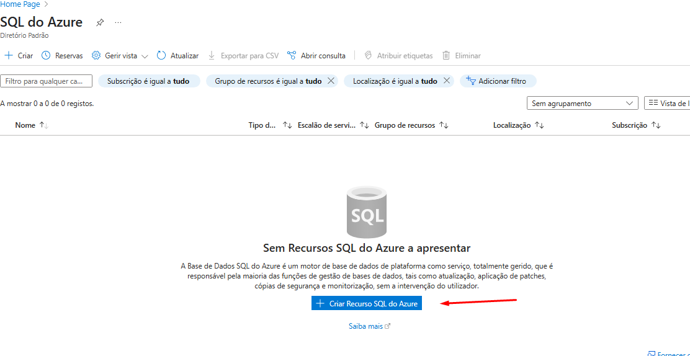

# projetodiocloud02

Segundo projeto do curso XP Inc. - Cloud com Inteligência Artificial, onde é mostrado a criação de uma instância e um novo banco de dados.

** LEMBRETE **

Projeto de inicio de curso, nunca realize essas configurações para fins de produção.
Caso as imagens fiquem quebradas utilize "Ctrl + F5" ou "⌘+Shift+R"

---

## Passo a passo

1.  Crie uma conta no portal Azure: https://portal.azure.com/

2.  Na tela principal do azure, digite na barra de pesquisa, "sql" e clique em SQL Azure

  
3.  Clique em "Criar Recurso SQL do Azure" na tela SQL do Azure, após clique em "criar" no quadro de "Instâncias geridas SQL"

  

4.  Já na tela de configuração, configure conforme imagens

**Importante**
 1.  Selecione a região "(US) West US 2"
  
 2.  No bloco de autenticação defina o seu usuário como "administrador do Microsoft Entra"
  
 3.  Deixei o uso mínimo de vCores e em Armazenamento pois os fins são educativos

  

  

  

  

5.  Revise suas configurações e clique em criar

6.  Aguarde a implementação da instância, ao concluída exibirá essa tela

7.  Na tela da instância gerada, crie uma nova base de dados

8.  Nomeie sua nova base e depois clique em "Rever + criar", confira e clique em criar novamente

9.  Após a criação, essa é a tela que confirma que seu banco foi criado com sucesso, boaa.

