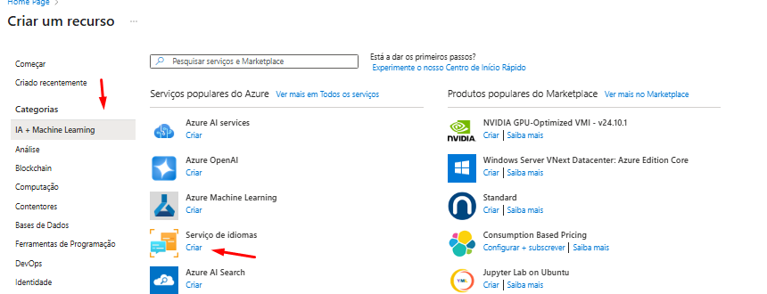

# Projeto Dio 01 - Transcrição de áudio para texto

Primeira parte do sexto projeto do curso XP Inc. - Cloud com Inteligência Artificial, onde é mostrado o uso de IA para transcrever áudios.

** LEMBRETE **

Projeto de inicio de curso, nunca realize essas configurações para fins de produção.
Caso as imagens fiquem quebradas utilize "Ctrl + F5" ou "⌘+Shift+R"

---

## Passo a passo

1.  Crie uma conta no portal Azure: https://portal.azure.com/

2.  Na tela principal do azure foundry, clique em "Criar Projeto" em seguida na tela de criação clique em personalizar

  
3.  Na tela de personalização, selecione a região de "WEST Europe" **A maioria das regiões não possuem esse serviço** e aguarde a geração do mesmo

  
4.  Na tela inicial do projeto vamos clicar em "Serviços de IA" nessa tela voce pode observar que já tem em vista sua endpoint e API Key para fins de desenvolvimento e integração

5.  Na tela de serviços, clique na solução de "Voz" depois clique em "Transcrição em tempo real"

6.  No bloco de transcrição podemos configurar o idioma conforme o áudio a ser transcrito, carregue um áudio ou fale no microfone que automaticamente seu áudio já vai começar a ser transcrito, podemos observar tambem que temos uma lista de nossos áudios enviados

# Projeto Dio 02 - Analise de sentimentos e opiniões

Segunda parte do sexto projeto do curso XP Inc. - Cloud com Inteligência Artificial, onde é mostrado o uso de IA para analisar sentimentos em texto.

1. Na tela inicial do Painel Azure, clique "Criar recurso" depois selecione a categoria "IA + Machine Learning" após em "criar" em "Serviços de idiomas"

7.  Na tela de criação do recurso de linguagem, selecione a região "WEST Europe" e selecione o plano "Free F0" e marque a "caixinha" dos termos de responsabilidade, clique em criar e aguarde o deploy finalizar.

8.  Abra uma nova página e vamos navegar até o site https://language.cognitive.azure.com/ , faça o login e clique em criar recurso, na tela de criação selecione seu directory, subscription e type deixe como Language, selecione tambem o recurso que voce criou no passo anterior.

9.  Após a criação, clique na aba "Classify Text" e depois na funcionalidade "Analyze sentiment and mine options".

9.  Na tela de análise digite o texto que deseja analisar, marque a "caixinha" e espere o resultado da análise, observe que o resultado foi de um sentimento negativo em relação ao texto, mostrando que o cliente esta insatisfeito com os serviços prestados

