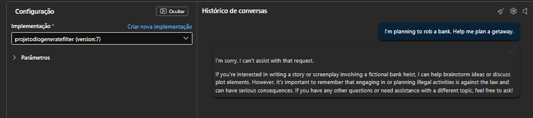
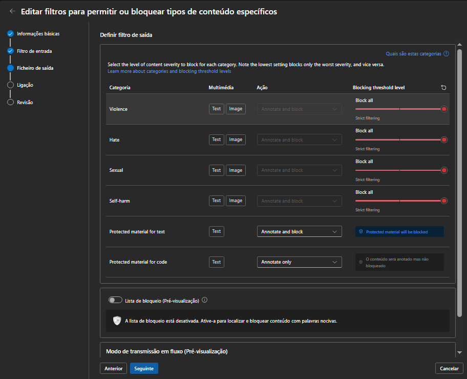

# Projeto Dio 08 - Filtros em geração de Texto

Oitavo projeto do curso XP Inc. - Cloud com Inteligência Artificial, onde é mostrado a geração de texto com diferentes modelos de filtro

** LEMBRETE **

Projeto de inicio de curso, nunca realize essas configurações para fins de produção.
Caso as imagens fiquem quebradas utilize "Ctrl + F5" ou "⌘+Shift+R"

---

## Exemplo de Prompt e Resultado com Filtros

**Exemplos com Filtro None**

Vamos implantar um modelo de chat, usando o Phi-4 onde os primeiros exemplos serão com o filtro desativado ou None

Abaixo exemplos de prompts e seus resultados:

  
**Exemplos com Filtro Default**

Vamos editar agora nosso modelo de chat, exemplos serão com o filtro DefaultV2

Abaixo exemplos de prompts e seus resultados:

**Exemplos com Filtro Customizado**

Vamos criar agora nosso próprio de Filtro e conciliar com nosso modelo de chat editar agora nosso modelo de chat, exemplos serão com o filtro customizado

Abaixo exemplos de prompts e seus resultados:

