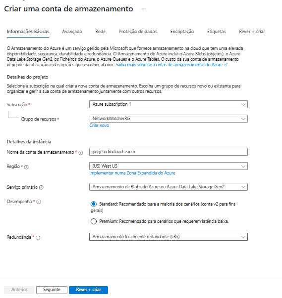

# projetodiocloud07

Sétimo projeto do curso XP Inc. - Cloud com Inteligência Artificial, onde é mostrado a criação de recursos cognitivos, criação de conta de armazenamento e container, e criação de um recurso de busca de dados, configuração e integração da conta de armazenamento ao recurso de busca, demonstração de resultado

** LEMBRETE **

Projeto de inicio de curso, nunca realize essas configurações para fins de produção.
Caso as imagens fiquem quebradas utilize "Ctrl + F5" ou "⌘+Shift+R"

---

## Passo a passo

1.  Crie uma conta no portal Azure: https://portal.azure.com/

2.  Na tela principal do azure, digite na barra de pesquisa, "search" e clique em "Azure AI Search"

  
3.  Preencha a criação do serviço de pesquisa se atentando a **localização e a "escala de preço" como "Básica"**

4.  Após a criação do serviço de pesquisa, vamos criar um novo recurso "Azure AI services", **novamente atenção a região e escala de preço**

5.  Após a criação, vamos voltar a página inicial e criar uma conta de armazenamento, **atenção ao "desempenho" e redundância** selecione o standard e "armazenamneto localmente redundante(LRS)"

6.  No painel de armazenamento, vamos permitir acesso anônimo ao blob entrando em Definições > configuração, mude para ativado e salve as informações

7.  Vamos criar um container agora, clique em Armazenamento de dados > Contentores, configure conforme foto e depois de criado clique no mesmo

8.  Vamos carregar nossos dados agora, pra facilitar os dados podem ser baixados direto desse link da Microsoft https://aka.ms/mslearn-coffee-reviews , baixe e descompacte e suba os arquivos docx ao container

9.  Após o upload, vamos para o painel do nosso recurso search criado no passo 3, clique em importar dados.

10.  Na tela de importação, selecione a origem de dados como "Armazenamento de Blobs do Azure", **na cadeia de ligação, clique em "selecionar uma ligação existente", selecione nossa conta de armazenamento e nosso container em seguida, a tela final ficara conforme a ultima foto desse passo

11.  Clicamos em seguinte e vamos para a aba de "Add cognitive skills", selecione conforme fotos abaixo

12.  Clique em seguinte e vamos para aba "Customize target index", selecione conforme fotos

13.  Clique em seguinte e vamos para a aba de "Create Indexer" deixe conforme foto

14.  Após finalização, voltamos ao painel do search, confirmamos se os indexadores estão ok.

15.  Confirmado, agora vamos ao explorador de procura e ver realmente nossa pesquisa, no painel podemos clicar em "ver" e mudar para JSON (acho mais legível), colocamos na chave "search" -> "locations: 'Chicago'" e podemos observar no resultado todos os review que vieram da Cidade de Chicago, muito legal!!

